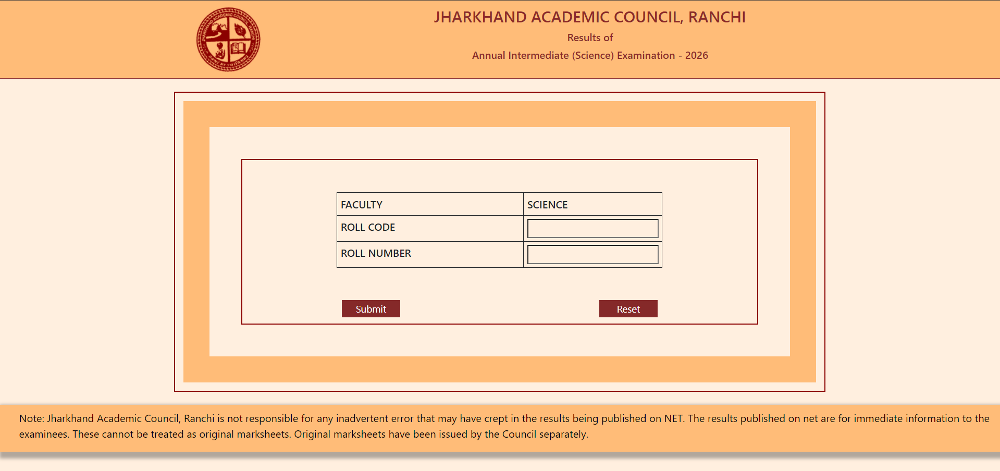
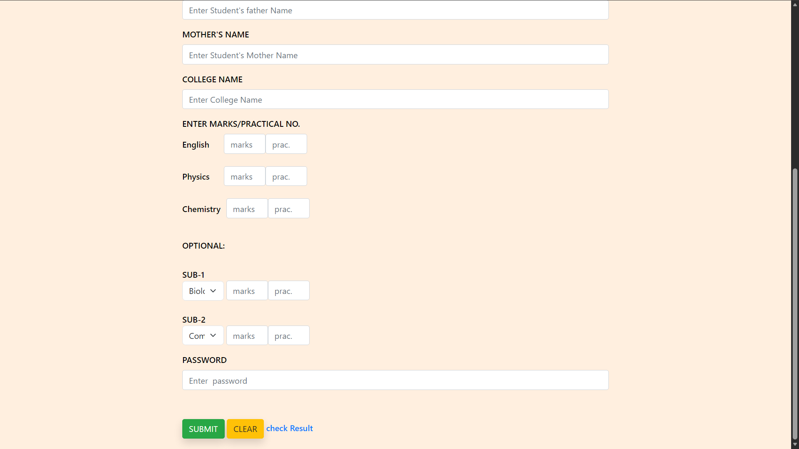
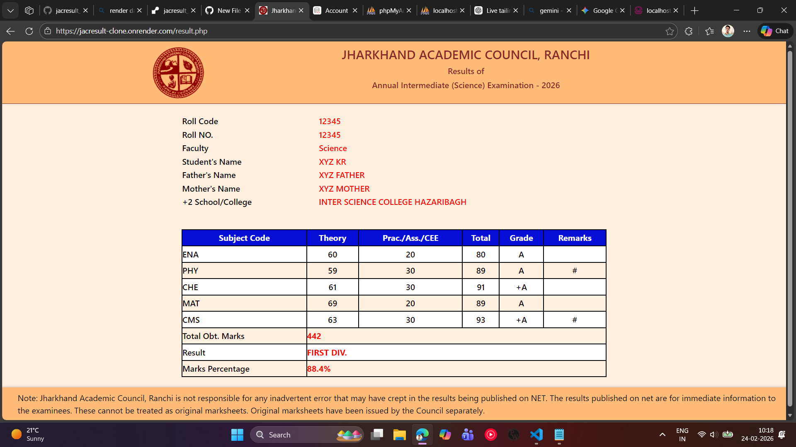

# Jharkhand Academic Council (JAC) Result Clone

 <!-- Replace this with your screenshot image -->

## 🔗 Live Preview

You can see the live preview of the project here:
[https://jacresult-clone.onrender.com/](https://jacresult-clone.onrender.com/)

---

## 📖 Project Overview

This is a **clone of the Jharkhand Academic Council (JAC) Result portal**.
It allows students to view their annual intermediate results online.

The project is implemented using:

* **PHP** (server-side logic)
* **HTML/CSS/Bootstrap** (frontend)
* **jQuery** (for dynamic interactions)
* **Sessions** (to manage student result data securely)

---

## 💻 Features

1. Students can **view their results** for multiple subjects including optional subjects (MAT/BIO, CMS/ECO).
2. Dynamic calculation of **total marks** and **grades**.
3. **Optional subjects logic** implemented so that only relevant subjects appear.
4. **Secure access using sessions**. Only students with an ID can view results.
5. **Add new student results**:

   * Click the **Reset** button **twice** to open the form.
   * Fill in all required fields (name, roll, marks, etc.).
   * Use the password **`DOST`** to save the new student record.

---

## ⚙️ How to Use

1. Go to the **live preview**: [https://jacresult-clone.onrender.com/](https://jacresult-clone.onrender.com/)
2. If your result is already saved, it will appear automatically after login.
3. To **add a new student result**:

   * Double-click the **Reset** button.
   * A form will appear.
   * Fill in all required fields.
   * Enter the password `DOST` to save the data.

---

## 📸 Screenshots

Include screenshots of:
 

* Home page / result page
* Student form (after clicking Reset)
*  
* Example result displayed

**Example:**

 <!-- Replace with your screenshot -->

---

## 🛠️ Implementation Notes

1. All student data is stored temporarily in **PHP sessions**.
2. Optional subjects logic is handled with `if(isset())` statements.
3. Dynamic calculation of **total marks, grades, and percentage** is implemented in PHP.
4. The clone project is a **learning exercise** to understand session management, PHP forms, and dynamic table generation.

---

## ⚠️ Important Notes

* This project is **for learning purposes only**.
* Original marksheets are issued by Jharkhand Academic Council, Ranchi.
* Data will be cleared if the server restarts (because it uses sessions).

---

## 📂 How to Run Locally

1. Clone this repository:

```bash
git clone git clone https://github.com/Verma1235/jacresult_clone.git
```

2. Place it in your **local PHP server** (like XAMPP, WAMP, or MAMP).
3. Open `index.php` in a browser.
4. Ensure `sessions` are enabled in your PHP configuration.

---

## 🔑 Password to Save Data

<h2> * Password: `DOST` </h2>

---

## 🎯 Future Improvements

* Connect to a **database** (MySQL) for permanent storage.
* Add **login authentication** for multiple students.
* Improve frontend design and mobile responsiveness.

---

### ⭐ Credits

* Project inspired by the **Jharkhand Academic Council (JAC) result portal**.
* Developed as a **clone for learning PHP,MYSQL database, sessions, and frontend design**.

